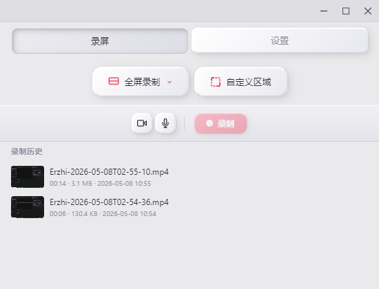
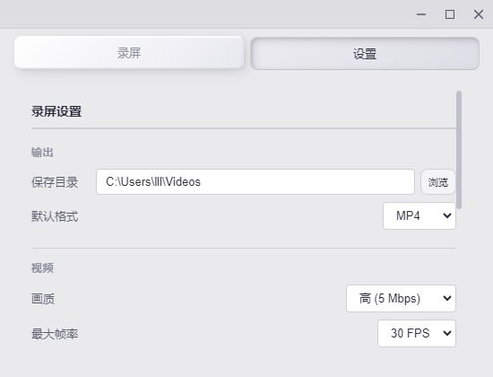
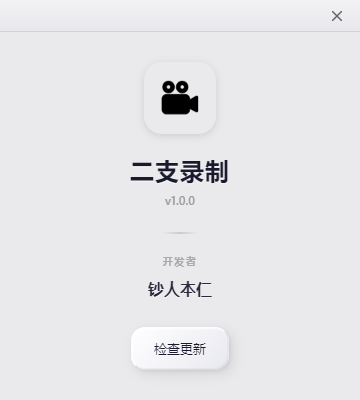
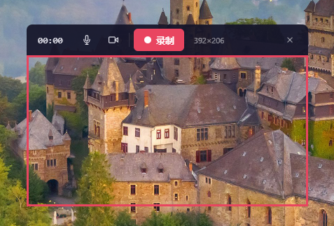

这款屏幕录制与贴图工具是一款功能强大且轻量级的桌面应用，专为满足高效录屏与视觉创作需求而设计。它支持全屏、自定义区域及多显示器的高清录制，并提供灵活的码率与帧率调节，结合 Windows 平台硬件加速 H.264 编码，确保视频流畅清晰。软件内置强大的实时绘图与标注功能（如画笔、箭头、矩形高亮），配合可自由拖拽的画中画摄像头预览、独立的麦克风与系统音频混合采集，让用户能够轻松制作出专业级的教学或演示视频。

在用户体验与后期处理方面，该工具提供了极简的悬浮控制栏与浮岛模式，支持全局快捷键操作，大幅降低录制时的干扰。录制的视频可直接导出为 MP4 或 GIF 格式。结合现代化的毛玻璃界面设计、系统托盘集成以及智能的自动保存机制，它为用户带来了一站式、流畅且极具美感的屏幕捕捉体验。
uu

安装包下载地址：release/或者https://github.com/CKKLIN/screen-capture---texture-tool/releases

问题反馈wx:richman--erzhi

首页

设置窗口

关于窗口

全屏录制窗口

自定义区域录制窗口

