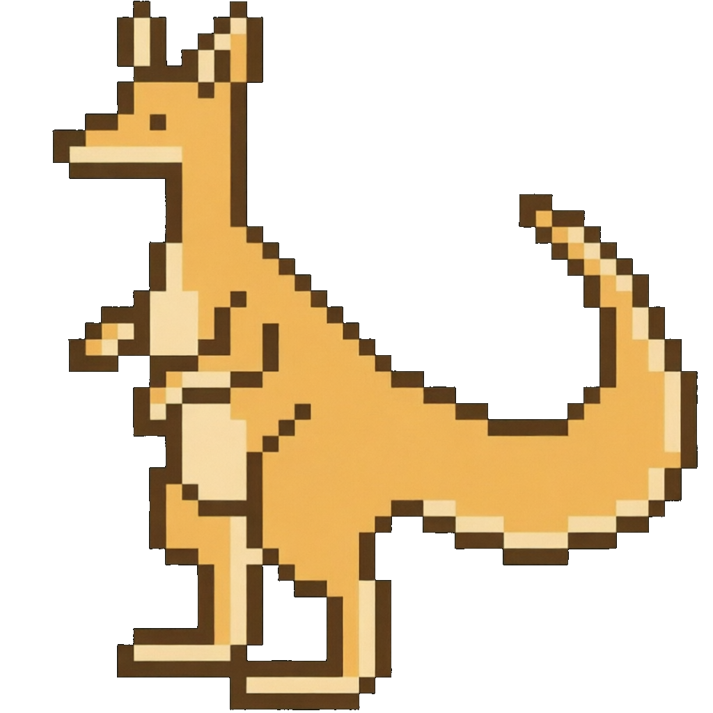

<div align="center">

# MUERZHI万能AI悬浮球

**以悬浮球为入口、可插拔接入各种功能的 Windows 桌面工具。目前已接入屏幕录制。**

[English](#english) · [中文](#中文)



</div>

---

## 中文

MUERZHI万能AI悬浮球 是一款 Windows 桌面应用，以一个常驻桌面的**悬浮球**作为统一入口。悬浮球本身是一个可插拔的功能容器，各类功能以"接入"的方式挂载其上——目前已接入**屏幕录制**，后续会持续接入更多功能。

### 核心理念

- **悬浮球是核心，不是附属。** 应用的一切能力都围绕悬浮球组织：点开即用、拖拽即走、常驻触手可及。
- **功能可插拔。** 录制只是第一个接入的能力。悬浮球的扩展槽位设计上预留了后续接入更多工具的空间。
- **轻量常驻。** 悬浮球低开销常驻桌面，需要时才唤起对应功能，不抢占焦点。

### 已接入：屏幕录制

录制功能在渲染层用 `getDisplayMedia` + `MediaRecorder` 完成采集，后处理（转码/裁剪/合并/GIF）在主进程用 FFmpeg 完成，支持硬件编码加速。

- **全屏 / 区域录制** —— 可拖拽选区，边框与悬浮岛实时反馈
- **多屏合并** —— 多显示器分别录制后按各屏 bounds 合成到一张画面
- **摄像头叠加** —— 摄像头预览作为独立悬浮窗，可拖动
- **音频采集** —— 麦克风 + 系统音频，实时电平显示
- **画笔标注** —— 录制中在画面上实时绘制
- **格式转换** —— WebM / MP4 / GIF，支持裁剪
- **硬件编码** —— 自动探测 NVENC / QSV / AMF，失败回退软编
- **全局快捷键** —— 录制/暂停/截图等

### 已接入：AI 悬浮岛（与 Claude Code 集成）

悬浮球内置与 Claude Code CLI 的桥接：安装 Claude Code hooks、本地 HTTP 服务器接收 agent 状态，在悬浮岛上展示"思考中 / 工作中 / 待审批"，权限请求可就地批准/拒绝。

### 技术栈

Electron 28 · Vue 3 · Pinia · vue-router · fluent-ffmpeg · TypeScript

### 安装与运行

```bash
npm install
npm run dev          # 本地开发
npm run build        # 打包 Windows 安装包
```

> 依赖通过 npmmirror 镜像安装（见 `.npmrc`）。

---

## English

**MUERZHI Universal AI Floating Ball** is a Windows desktop app whose single entry point is a persistent **floating ball** on the desktop. The ball is a pluggable container — features are *mounted onto* it. **Screen recording** is the first integrated feature; more are planned.

### Core idea

- **The floating ball is the product, not an accessory.** Every capability is organized around it: click to open, drag to move, always within reach.
- **Pluggable features.** Recording is just the first module. The ball is designed to host more tools over time.
- **Lightweight & resident.** The ball stays on the desktop with low overhead; features wake on demand without stealing focus.

### Integrated: Screen Recording

Capture happens in the renderer via `getDisplayMedia` + `MediaRecorder`; post-processing (transcode/crop/merge/GIF) runs in the main process with FFmpeg and hardware-encode acceleration.

- **Full-screen / region recording** — draggable selection with live border & island feedback
- **Multi-screen merge** — per-display capture composited by bounds into one frame
- **Camera overlay** — camera preview as a draggable floating window
- **Audio capture** — microphone + system audio with live level meters
- **Drawing annotations** — draw on the frame while recording
- **Format conversion** — WebM / MP4 / GIF, with cropping
- **Hardware encoding** — auto-detects NVENC / QSV / AMF, falls back to software
- **Global shortcuts** — record / pause / screenshot, etc.

### Integrated: AI Island (Claude Code integration)

The ball ships with a bridge to the Claude Code CLI: it installs Claude Code hooks, runs a local HTTP server to receive agent state, and surfaces "thinking / working / awaiting approval" on the floating island — approve or deny permission requests in place.

### Tech Stack

Electron 28 · Vue 3 · Pinia · vue-router · fluent-ffmpeg · TypeScript

### Install & Run

```bash
npm install
npm run dev          # local development
npm run build        # build the Windows installer
```

> Dependencies install via the npmmirror registry (see `.npmrc`).
